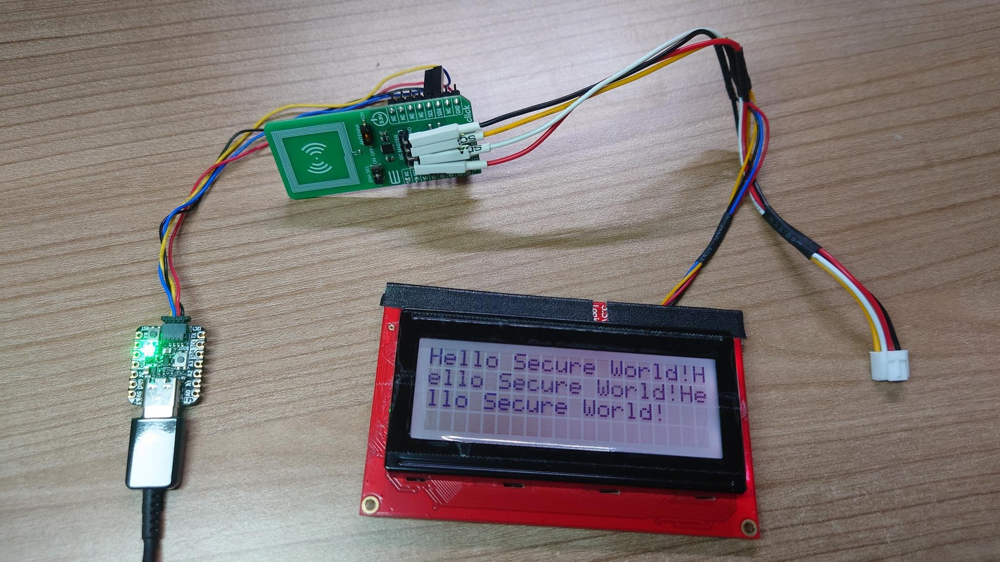

# Welcome to seccid - the secure element CCID connector

This is a [secure element CCID library](https://github.com/ckahlo/seccid) / Arduino application spin-off from the DLR Exp.007 / Blofeld experiment.\
The code builds upon [Adafruits Version of TinyUsb for Arduino](https://github.com/adafruit/Adafruit_TinyUSB_Arduino), but could also run with [the original pure TinyUSB](https://github.com/hathach/tinyusb) as well.

## Updates
### 2025-01-23:
- updated CCID driver for compatibility with Adafruit_TinyUSB 2.4.0+, tested up to 3.4.2
- removed the CCID interface run() method from main loop and added new callback behaviour
- added explicit USB serialnumber, containing chip type, chip version, ROM version, flash ID

## Work in progress

The current version is a re-write from scratch for debugging purposes and to onboard scientists and developers beginning with the [DLR MAPHEUS](https://www.dlr.de/mp/en/desktopdefault.aspx/tabid-13266/23204_read-80521/) [13 campaign at ESRANGE Space Center](https://sscspace.com/esrange/rocket-ballon-activities/).\
The major change is the migration from NXPs UM11225 T1-over-I2C (T1oI2C) for SE050 and SE051 towards GlobalPlatform APDU Transport over SPI/I2C v1.0 | [GPC_SPE_172](https://globalplatform.org/specs-library/apdu-transport-over-spi-i2c-v1-0-gpc_spe_172/) - also referred to as *T=1'* . Control requests are different and will mostly not work at the moment, but will be fixed soon. As well there will be other (unexpected) bugs due to the different nature how transfers are encoded. However, the GPC_SPE_172 might be adopted by other GlobalPlatform-compliant manufacturers as well.

## What is this good for?

The goal was to provide a (previously missing?) USB CCID class driver for I2C secure elements in a well-known and widespread USB stack, not just another local show. So it becomes usable with a wide range of MCUs and could be ported and easily extended as needed. The USB CCID class driver is used by a minimal application to receive CCID XFER blocks and forward the contained APDUs over I2C to the secure element.\
Scientists involved in our MAPHEUS experiments may use this code together with some commercial-off-the-shelf RP2040-based device, a custom SE051 breakout [based on this schematics from Michael Grand](https://github.com/mimok/se050-breakout) or a commerical product such as the [MIKROE SE051 PLUG&TRUST CLICK](https://www.mikroe.com/se051-plugtrust-click) or the [original NXP DevKits](https://nxp.com/SE051) together with I2C sensors and actors on the trusted I2C bus.\
All in all seccid brings you secure embedded (sensor) networks as a smartcard interface to your laboratory desktop.\
You can use it to simply configure the secure element over PCSC and USB CCID using the NXP SEMS Lite toolchain and the NXP PersoApplet.\
But you could just store keys in there for your own applications.

## Motivation? More about Exp.007.

The experiment description (German and English in the same document) of [Exp.007 / Blofeld](docs/Exp007_Blofled%20MP12%20Experiment%20Description%20de_en.pdf) from MAPHEUS 12 gives an idea about the future challenges of security of sensor networks on space vehicles. While lot's of the other parts running on [Pauls lockable Teensy 4.x boards starring the NXP RT1062](https://github.com/PaulStoffregen/cores) or [Andreas and Andrejs powerful USBArmory](https://github.com/usbarmory/usbarmory) aren't published yet, this repository should help to gain a deeper understanding of and easier development with I2C secure elements for secure embedded sensor networks.

## Example usage

If you own a SE051C2 board with OEF ID A8FA (otherwise adjust the keys below accordingly) and e.g. a [SparkFun SerLCD](https://github.com/sparkfun/OpenLCD) you could wire them up as a chain and use [Martins really great GlobalPlatformPro](https://github.com/martinpaljak/GlobalPlatformPro) to send a secured command to the display:
```
java -jar gp.jar -r "DLR/CK TinyUSB CCID 0" -a FFFFC201 -a FFFFC000 -sdaid A0000003965453000000010300000000 --key-enc bfc2dbe1828e035d3e7fa36b902a05c6 --key-mac bef85bd7ba0497d628781ce47b188c96 --key-dek d873f316be297f2fc9c0e45f54710699 -d -s 80030030224120010002720103001348656C6C6F2053656375726520576F726C64210400020001
```
\



## License

The default license for [this project](https://github.com/ckahlo/seccid) is the [GPL v3](LICENSE)

## Thanks

Special thanks and greetings go to my friends and colleagues at DLR in particular Dr. Jens "Fusi" Hauslage (Geraffel!!) and Maximillian Sturm.
[Some impressions of past missions](https://www.instagram.com/mapheusrocket) and more at [MORABA](https://www.instagram.com/moraba_dlr/).

